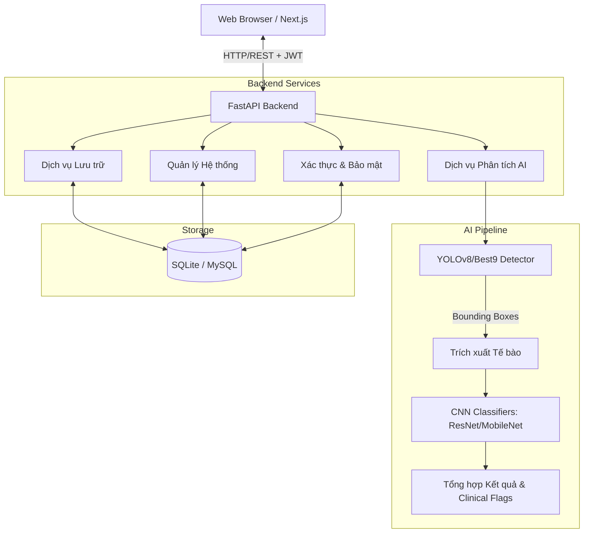

# Kiến trúc Hệ thống HemaVision AI

Dự án áp dụng kiến trúc phân tách hoàn toàn giữa Frontend và Backend, giao tiếp với nhau qua chuẩn RESTful API.

## Sơ đồ Tổng quan

## Các module chính

### 1. Frontend (Next.js 16)
- **Framework:** Next.js (App Router), React 19.
- **Styling:** Tailwind CSS v4.
- **State Management:** Zustand (Auth) và React Hook Form (Forms).
- **Data Fetching:** TanStack React Query.
- **Biểu đồ:** Recharts, Chart.js (Radar).

### 2. Backend (FastAPI)
- **Framework:** FastAPI (ASGI siêu tốc).
- **ORM:** SQLAlchemy (tương tác với DB qua Python object).
- **Migration:** Alembic (quản lý phiên bản DB).
- **ML / Vision:** Ultralytics (YOLO), OpenCV, NumPy, Keras/H5py.
- **Security:** Passlib (Bcrypt), PyJWT (tạo và giải mã token).

### 3. AI Pipeline
Luồng xử lý một ảnh:
1. **Tiền xử lý:** Decode ảnh base64/upload thành ma trận numpy.
2. **Phát hiện (Detect):** Dùng `yolov8n-bccd.pt` quét tìm vùng chứa tế bào, trả về tọa độ `[x, y, w, h]`.
3. **Cắt ảnh (Crop):** Tách ảnh gốc thành nhiều ảnh nhỏ dựa trên tọa độ thu được.
4. **Phân loại (Classify):** Đưa từng ảnh nhỏ qua mô hình phân loại (ví dụ: `best_model_v2.keras`) để lấy nhãn và độ tự tin (Confidence).
5. **Gán nhãn & Thống kê:** Tổng hợp mảng kết quả, đếm số lượng, kiểm tra đối chiếu với ngưỡng cảnh báo y tế (Clinical Flags).
